# Probability Redistribution in 3-Way Sports Betting Markets
### Structural Mispricing of the Draw Outcome in NHL Regulation Markets

**Charles Feinstein**
Whizard Analytics

March 2026

---

## Abstract

In a 3-way betting market, the probabilities of all outcomes must sum to 100%. This conservation constraint means that when one outcome is mispriced, the error must be absorbed by the others. This paper documents a persistent structural underpricing of the draw (overtime) outcome in the NHL 3-way regulation market, quantified across 7,142 games, 7 US sportsbooks, and 5 NHL seasons. The average devigged fair draw probability across bookmakers is 21.0%, while the observed draw rate is 22.3% over the full sample and 25.8% in the high-parity 2025-26 season. A Bayesian-calibrated Poisson model that tracks the draw rate in near-real-time produces a realized ROI of +8.1% on edge-weighted bets across 1,593 post-calibration games. The mispricing is attributed to market illiquidity, behavioral biases favoring team-based outcomes, and the market's reliance on long-term averages that cannot adapt to regime changes.

---

## 1. Introduction

Every betting market obeys one inviolable rule: the true probabilities of all possible outcomes must sum to 100%. Bookmaker odds don't sum to 100% because they include vig (the house margin, typically 4-5%), but underneath the vig, the fair probabilities must. This paper works entirely with devigged fair probabilities, stripping the bookmaker's margin so we can see what the market actually believes.

In a standard 2-way market (home wins or away wins), the constraint is straightforward. If the fair market probability is 55% for the home team, the away team gets 45%. There are only two vessels, and bettors actively price both. Sharp money flows into whichever side is mispriced, and the correction is fast, visible, and well-studied.

This paper examines what happens when you add a third vessel.

In the NHL 3-way regulation market, there are three possible outcomes: home wins in regulation, away wins in regulation, or the game goes to overtime (a draw). Those three probabilities must still sum to 100%. But the third outcome, the draw, introduces a structural asymmetry that doesn't exist in 2-way markets.

### Why 3-Way Markets Are Different

In a 2-way market, mispricing is self-correcting. If the home side is overpriced, the away side is mechanically underpriced by the same amount. Bettors see it. Sharps exploit it. The line moves. Equilibrium is restored quickly because both sides receive attention and capital.

In a 3-way market, the correction mechanism breaks down. When probability mass shifts between outcomes, it can flow in multiple directions. If home wins drop from 45% to 40%, those 5 percentage points could go to the away side, the draw, or some combination of both. The market has to price three interconnected outcomes instead of two, and it consistently gets one of them wrong: the draw.

The reason is behavioral. Bettors engage with teams. They bet the Bruins to win, or the Rangers to win. They pick sides. The draw, a bet that the game will be tied after 60 minutes, attracts almost no recreational action. In a 2-way market, neglecting one side automatically means overweighting the other, and the imbalance is obvious. In a 3-way market, the neglected outcome can sit mispriced for extended periods because it's not directly connected to either side's action. The market can be roughly correct on home and away individually while systematically underpricing the draw, because the draw acts as the residual absorber of probability mass that nobody is actively trading.

This creates an opportunity that simply does not exist in 2-way markets. The sum-to-100% constraint is the same, but the third outcome acts as a pressure valve that the market ignores.

This paper documents how the conservation constraint creates a structural mispricing in NHL draw pricing, quantifies that mispricing across 1,593 games and 7 bookmakers, and presents the Bayesian model that exploits it.

---

## 2. Market Structure

### The Zero-Sum Constraint

Sports betting is a negative-sum system. Unlike equity markets, where multiple participants can profit simultaneously as value is created, betting markets redistribute a fixed pool. One side of each bet wins, the other loses, and the bookmaker takes 4-5% off the top. The total payout to winners is always less than the total collected from losers.

This means the profit available to bettors on any given night is fixed and finite. When bettors cluster around certain outcomes, the market redistributes that fixed pool in predictable ways.

### Probability Mass Conservation

In any betting market, the implied probabilities must sum to 100%. This is not an assumption. It's a mathematical identity. In a 2-way market (home/away), this means:

**P(Home) + P(Away) = 100%**

In the NHL 3-way regulation market, there are three possible outcomes:

- **Home team wins in regulation**
- **Away team wins in regulation**
- **Draw (game goes to overtime or shootout)**

And the constraint becomes:

**P(Home Reg) + P(Away Reg) + P(Draw) = 100%**

Think of it as three connected vessels. The total water (probability) is fixed at 100%. If probability flows into the Draw vessel, it must drain from Home, Away, or both. If Draw empties, Home and Away must absorb the difference.

The MARKET assigns probabilities to these three outcomes by setting odds. The ACTUAL outcomes play out on the ice. When reality diverges from market pricing, when draws happen more often than the market expects, the probability mass has been redistributed in a way the market didn't anticipate.

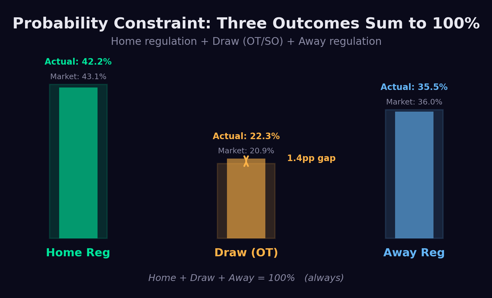

*Figure 1 shows the three outcomes as bars: home regulation win, draw (OT/SO), and away regulation win. The faded outer bar is what the market thinks each probability should be; the solid inner bar is reality. Notice how the market overestimates home and away while underestimating draws. The double-headed arrow on the draw bar highlights the 1.4pp gap. This is a constraint visualization: the three bars must always sum to 100%.*

### Why the Third Vessel Changes Everything

In a 2-way market, if one side is mispriced, the other side is automatically mispriced by exactly the same amount in the opposite direction. The mispricing is transparent and the correction is direct. Sharp bettors see the home line is too high, bet the away side, and the line moves.

In a 3-way market, mispricing can hide. The market can be approximately correct on home and away while systematically underpricing the draw, because the draw is the residual outcome that absorbs rounding errors, bettor neglect, and structural biases. Nobody is actively correcting the draw price because nobody is betting it in volume.

This is analogous to options markets, where certain contracts become mispriced not because the underlying prediction is wrong, but because market structure and participant behavior create persistent inefficiencies. The draw in the NHL 3-way market occupies the same structural role: a neglected instrument within a constrained system, where the mispricing oscillates in severity over time.

### The Vig Question

An informed reader will immediately ask: what about the vig? Bookmakers build a 4-5% margin into their odds, which means the raw implied probabilities sum to more than 100%. If you naively read the odds, every outcome looks overpriced. How can we claim the draw is *underpriced* when the vig inflates everything?

The answer has two parts.

First, the vig is not distributed evenly across all three outcomes. In a 2-way market, the overround is split roughly proportionally between home and away. In a 3-way market, the distribution is more complex. Bookmakers load vig based on where the action is and where their liability sits. Because recreational bettors overwhelmingly bet home and away, the vig on those outcomes tends to be higher in absolute terms. The draw, receiving less action, often carries a different vig profile. This means raw odds don't tell you much about the true fair probabilities without first stripping the margin.

Second, and more importantly, the mispricing we document exists *after* removing the vig entirely. Throughout this paper, every comparison between the model and the market uses power-devigged fair probabilities, not raw offered odds. Power devigging (detailed in Part 3) finds the exponent that makes the three fair probabilities sum to exactly 100%, respecting the relative pricing structure while removing the house edge. The draw is underpriced at the fair probability level, not just at the offered odds level. The vig is a separate issue from the mispricing.

To put concrete numbers on it: the average devigged fair draw probability across 7 bookmakers is 21.0%. The actual draw rate is 24.1%. That 3.1 percentage point gap exists entirely after the vig has been stripped. The bookmaker's margin makes the offered odds worse than fair (as it does for every outcome), but the underlying fair probability assigned to draws is still too low. The edge is structural, not an artifact of the juice.

There's one more dimension worth noting: **3-way markets carry substantially higher vig than 2-way markets.** A standard NHL 2-way moneyline has an overround of roughly 4-5%. The NHL 3-way regulation market averages 8.4% overround across US bookmakers, ranging from 5.3% at BetRivers to 12.7% at William Hill. That's roughly double the 2-way vig.

This higher margin serves two purposes from the bookmaker's perspective. It compensates for the added complexity of pricing three outcomes instead of two, and it provides a buffer against the exact kind of mispricing this paper documents. The bookmaker knows the draw is harder to price accurately, so they charge more for the privilege of betting in this market.

For bettors, the higher vig means the edge threshold is higher. You need a larger mispricing to overcome the additional margin. But the data shows the structural underpricing of draws (3.1pp on average) exceeds even the elevated vig. The higher vig also functions as a moat: it deters casual sharp bettors from entering the 3-way market, which helps preserve the inefficiency for those who understand the structure well enough to exploit it despite the cost.

---

## 3. The Structural Mispricing

### Two Seasons, Two Completely Different Distributions

These numbers aren't hypothetical. They come from over 7,000 completed NHL games across six seasons, cross-referenced against devigged 3-way odds from 7 major sportsbooks. But the headline stat comes from what happened between the last two seasons:

| Outcome | 2024-25 | 2025-26 | Change |
|---------|---------|---------|--------|
| Home wins in regulation | **45.1%** | 39.9% | -5.2pp |
| Away wins in regulation | 34.2% | 34.3% | +0.1pp |
| Game goes to OT/SO (draw) | 20.7% | **25.8%** | +5.1pp |

In 2024-25, home teams dominated regulation, winning outright 45.1% of the time, the highest rate in four seasons. If you were betting that season, the smart play was home regulation wins. Games were being decided before overtime.

Then something shifted. In 2025-26, overtime games surged by over 5 full percentage points. One in four games now goes to overtime or a shootout. That probability mass didn't appear from nowhere. It came almost entirely from home regulation wins, which dropped 5.2pp. Away wins barely moved. The distribution completely reorganized itself.

The underlying driver is league parity. The 2025-26 NHL season has been characterized by an unusually compressed talent distribution. Fewer teams are dominant, fewer are hopeless, and the middle of the standings is packed tighter than any recent season. When teams are more evenly matched, games are closer. When games are closer, more of them reach the end of regulation tied. The overtime rate is not some random statistical blip; it is a direct consequence of competitive balance. Parity produces close games, and close games produce overtime.

This is a regime change in the truest sense. It is not that a few extra games happened to go to OT by luck. The structural conditions of the league, roster construction, salary cap dynamics, and the depth of talent across 32 teams, have shifted the baseline probability of a tied game at the end of 60 minutes. And because this is a structural shift rather than random variance, the elevated OT rate has persisted month after month rather than regressing to the historical mean.

And here's what the market thinks happens, averaged across both seasons:

| Outcome | Market Implied (Fair) |
|---------|---------------------|
| Home wins in regulation | 43.1% |
| Away wins in regulation | 36.0% |
| Draw (OT/SO) | **20.9%** |

The market priced draws at 20.9% across this entire period. In 2024-25, that was close: the actual rate was 20.7%. No harm, no foul. But in 2025-26, when the actual rate jumped to 25.8%, the market only adjusted its draw pricing to 21.3%. Reality moved 5.1 percentage points. The market moved 0.65.

**The market missed 87% of the shift.**

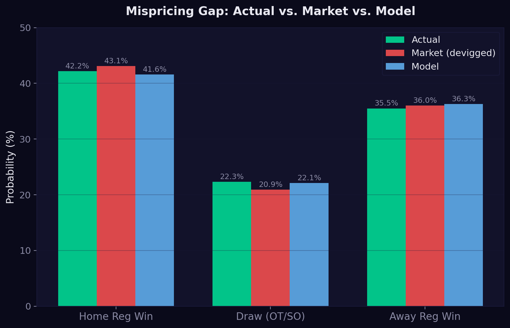

*Figure 2 shows how the model, market, and actual outcomes compare across all three outcomes. Notice how the model (blue) closely tracks actual results (green) on draws, while the market (red) systematically underprices them. The gap is small on home and away outcomes but pronounced on draws.*

### Why the Market Lags: The Long-Term Data Problem

The reason is that bookmakers are anchored to long-term data.

Bookmakers set 3-way lines based on years of historical data. Over the last six seasons, the OT rate has averaged 22.3%. That long-run average is baked into their pricing models, their risk systems, and their institutional memory. When the 2025-26 season started producing overtime games at a 25-26% rate, their models, trained on thousands of historical games, treated it as noise. A blip. Regression to the mean.

But it wasn't a blip. It was a regime change. And the market's reliance on long-term averages made it structurally incapable of reacting quickly.

This is the core problem: **the market uses too much history.** When you average 6,000+ games to price tonight's draw, you're implicitly assuming tonight's distribution looks like the last four years' distribution. That assumption is safe most of the time. But when the distribution genuinely shifts, when there's a real regime change, the market's long lookback window becomes an anchor that holds it underwater.

My model doesn't have this problem. It uses a Bayesian approach with a shorter effective lookback that blends the long-run prior with current-season evidence. When the 2025-26 OT rate started running hot, the model noticed within weeks. Its tie inflation parameter climbed from 1.30x to 1.40x, an 8% increase that tracked the regime change in near-real-time.

The market, meanwhile, was still pricing draws based on years of history where the OT rate was 20-21%. By the time the market's long-term average catches up, the model has already been exploiting the gap for months.

There's also a behavioral layer. Recreational bettors overwhelmingly bet on teams to win, not on draws. From a casual fan's perspective, picking a side is natural and entertaining. Betting on overtime is not. This creates a persistent demand asymmetry across the three outcomes.

This creates a structural imbalance. Money flows overwhelmingly into Home and Away, which pushes those odds down and draws those probabilities up. The bookmaker adjusts Home and Away lines to balance their exposure, but the Draw line gets much less action, so it receives less attention and less efficient pricing.

The result: even when the draw rate is stable, the market underprices it. And when the draw rate shifts upward, like it did this season, the market's long-term anchor and the bettor's preference for picking sides combine to widen the gap between pricing and reality.

### Monthly Volatility in the Draw Rate

That 22.3% average disguises substantial month-to-month variation. Month by month:

| Month | Draw Rate |
|-------|----------|
| January 2025 | 21.4% |
| February 2025 | 19.7% |
| April 2025 | 25.0% |
| October 2025 | 26.1% |
| November 2025 | 29.3% |
| December 2025 | 23.5% |
| January 2026 | 24.2% |
| March 2026 | 30.3% |

The actual draw rate ranges from **19.7% to 30.3%**, an 11 percentage point swing. Meanwhile, the market's fair draw pricing barely moves: it varies with a standard deviation of just 0.5 percentage points, stuck in a narrow band around 21%.

**An honest note on sample size:** most of this monthly variation is exactly what you would expect from pure binomial sampling noise. With roughly 174 games per month and a true draw rate around 22%, the expected standard deviation of the monthly draw rate is about 3.2 percentage points. The observed standard deviation is 3.1pp. The ratio is 0.98, meaning the month-to-month swings are almost entirely explained by sample variance, not by any underlying structural shift within a season.

This matters for interpretation. A month where the draw rate hits 29.3% does not necessarily mean "more games are going to overtime for structural reasons." It may just mean 66 out of 225 games happened to go to OT instead of the expected 50. At 174 games per month, you need roughly 1,700 games to pin down the draw rate within +/-2 percentage points at 95% confidence, and roughly 6,700 games for +/-1pp. Individual months are far too noisy to draw conclusions from.

The meaningful comparison is not month to month. It is season to season, where the sample sizes (1,200+ games) are large enough to distinguish real regime changes from noise. The 2024-25 to 2025-26 shift of 5.1pp, measured over thousands of games, is statistically robust. The monthly swings within a season are not.

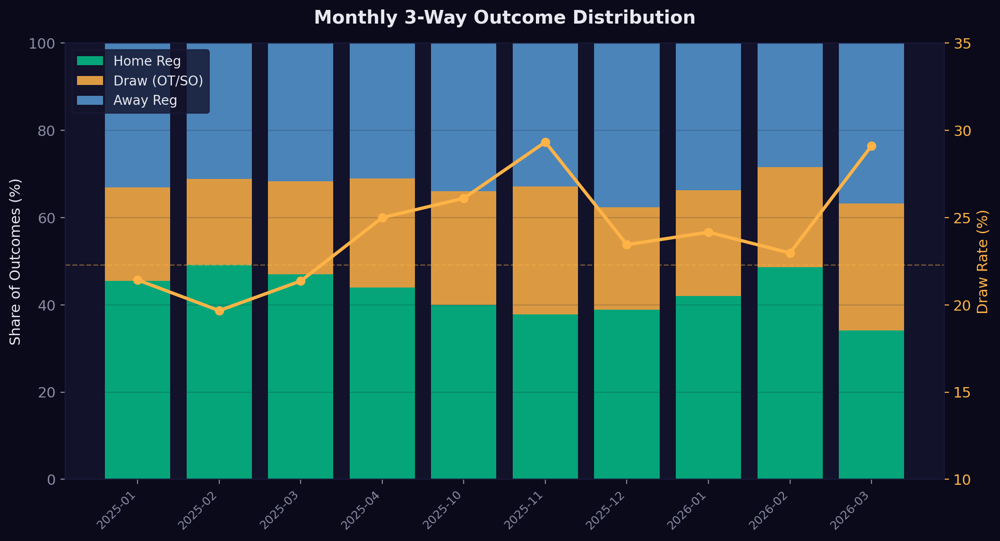

The market prices draws as roughly constant. At the seasonal level, reality can diverge significantly from that constant, and the market does not adjust. The conservation constraint dictates where the displaced probability mass ends up.

*Figure 3 stacks each month's actual 3-way distribution (green = home, amber = draw, blue = away) as a bar chart, with the amber line tracking the draw rate on the right axis. The dashed amber horizontal line at 22.3% is the long-run average. Much of the month-to-month variation is sampling noise, but the sustained elevation in 2025-26 reflects a genuine regime shift that the market has not repriced.*

### Where the Probability Mass Goes

The conservation constraint says that when draws increase, the probability must come from home wins, away wins, or both. The data shows it comes overwhelmingly from home wins.

Across the full dataset of 7,142 games spanning 5 seasons (2021-2026, 40 monthly observations), the Pearson correlation between monthly draw rate and monthly home win rate is **r = -0.75**. The correlation between draw rate and away win rate is r = +0.34. When draws go up, home wins go down. Away wins are largely unaffected.

In the post-calibration sample (1,738 games, 10 months from January 2025 onward), the relationship is even stronger: **r = -0.86 (p = 0.002)** for draws vs. home, r = +0.40 (not significant) for draws vs. away. The stronger correlation in the recent sample partly reflects the sharper regime change between the 2024-25 and 2025-26 seasons, and partly reflects the smaller sample amplifying the signal. The 40-month figure of r = -0.75 is the more conservative and reliable estimate.

| Month | Games | Draw% | Home% | Away% |
|-------|-------|-------|-------|-------|
| Jan 2025 | 224 | 21.4% | 45.5% | 33.0% |
| Feb 2025 | 122 | 19.7% | 49.2% | 31.1% |
| Mar 2025 | 234 | 21.4% | 47.0% | 31.6% |
| Apr 2025 | 132 | 25.0% | 43.9% | 31.1% |
| Oct 2025 | 180 | 26.1% | 40.0% | 33.9% |
| Nov 2025 | 225 | 29.3% | 37.8% | 32.9% |
| Dec 2025 | 226 | 23.5% | 38.9% | 37.6% |
| Jan 2026 | 240 | 24.2% | 42.1% | 33.8% |
| Feb 2026 | 74 | 23.0% | 48.6% | 28.4% |
| Mar 2026 | 81 | 28.4% | 34.6% | 37.0% |

Part of this correlation is mechanical. The three rates must sum to 100%, so if one goes up, at least one other must go down. Under pure random sampling with no structural bias, the expected correlation between any two of the three outcomes is approximately -0.50. The observed -0.75 (full dataset) exceeds this, indicating a genuine tendency for probability mass to transfer between home wins and draws specifically, beyond what the constraint alone would produce.

This makes intuitive sense. Most overtime games are close games where the home team was favored but could not close it out in regulation. When more games go to overtime, it is disproportionately home regulation wins that are being "converted" to draws.

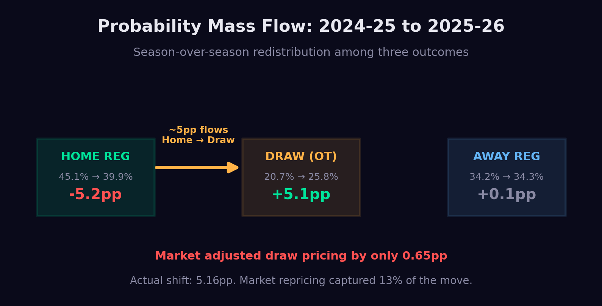

*Figure 4 maps the season-over-season probability shift. The big amber arrow shows ~5pp flowing from Home Reg to Draw between 2024-25 and 2025-26. Away barely moved. The annotation at the bottom shows the market's response: it adjusted draw pricing by only 0.65pp against a 5.16pp actual shift. That's the gap we exploit.*

---

## 4. Model Architecture

### The Poisson Foundation

Understanding that the market misprices draws is one thing. Building a model that can quantify the mispricing for each specific game, every single night, is another.

The model is built on the Poisson distribution, which estimates the probability of each team scoring a given number of goals based on their offensive strength and their opponent's defensive weakness. Given expected goals for both teams, the model calculates the probability of every possible scoreline: 1-0, 2-1, 3-2, 4-3, and so on.

Once I have the probability of every score, I can add them up three ways:
 P(Home Reg)
 P(Away Reg)
 P(Draw/OT)

This gives me a complete 3-way probability for every game. Because this accounts for every possible score, the three probabilities automatically sum to exactly 100%. The constraint is inherent to the method.

### The Calibration Problem

But raw Poisson has a problem. It systematically underestimates draws. The raw Poisson model says draws should happen about 16.3% of the time. The actual rate is 22.3%. That's a 35% underestimate.

Why? Because Poisson assumes goals are independent events. But hockey goals aren't truly independent. There are game-state effects (trailing teams pull their goalie, leading teams play conservatively), referee tendencies, and other factors that create a slight positive correlation between the two teams' scoring. This correlation pushes more games toward tied scores.

So I apply what I call tie inflation, a calibration factor that adjusts the raw Poisson draw probability upward based on historical data. The average tie inflation across my backtest is 1.35x, meaning I multiply the raw Poisson draw probability by about 1.35 to get the calibrated draw probability.

Critically, **the model does not use a fixed tie inflation.** I recalculate it using a Bayesian approach that blends long-run historical data with the current season's actual OT rate. The prior starts each season anchored to the multi-year historical average, then updates game by game as new results arrive. Early in a season, when the sample is small, the prior dominates and the model stays close to history. As the season progresses and data accumulates, the likelihood takes over and the model shifts toward the current regime.

This design was a deliberate choice to handle exactly the kind of regime change we observe in 2025-26. When league parity compresses the talent distribution and overtime rates climb to historically elevated levels, the model does not fight the data. It absorbs the new regime within weeks because the Bayesian update is continuous. In the 2024-25 season, my tie inflation averaged 1.31x, appropriate for a year where the actual OT rate was 20.7%. In 2025-26, when parity pushed the OT rate to 25.8%, the model's tie inflation climbed to 1.40x by early November. It adapted to the new regime in roughly 40 games of evidence.

The market, by contrast, is anchored to years of history where the OT rate averaged 22.3%. Bookmakers cannot selectively weight recent data the way a Bayesian model can. Their pricing reflects thousands of games across multiple seasons, and a single season of elevated overtime, no matter how persistent, barely moves the long-run average. The model's advantage is not that it has better data. It has the same data. The advantage is structural: the Bayesian framework lets it weight recent evidence appropriately while the market's institutional process cannot.

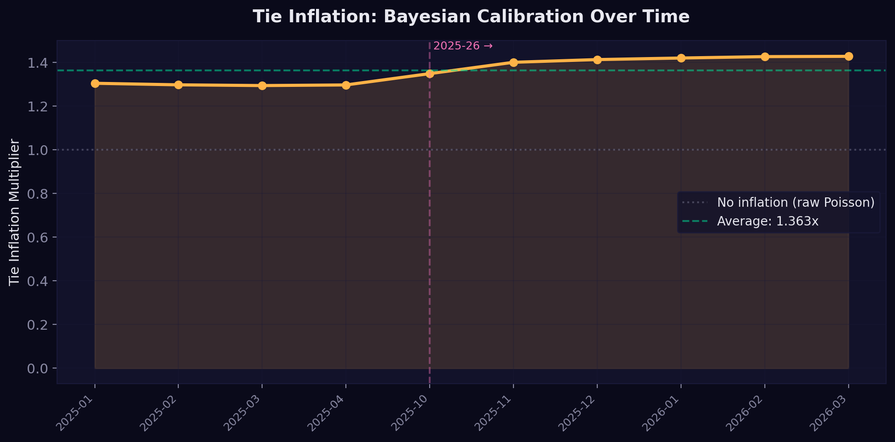

*Figure 5 plots the model's monthly tie inflation multiplier across both seasons. Notice the step-up at the 2025-26 season boundary (marked by the pink dashed line). The Bayesian prior starts each season anchored to history, then updates rapidly as new data arrives. By November 2025, the model had already absorbed the regime change. The market was still pricing off four-year averages.*

### Power Devigging: Seeing the Market's True Opinion

The other critical piece is understanding what the market actually thinks. Bookmaker odds contain vig (juice), the built-in house edge. To compare my model against the market, I need to strip the vig away and see the "fair" probabilities.

For a 3-way market, this isn't as simple as dividing by the overround. I use power devigging, which finds the exponent k such that:

fair_home^k + fair_draw^k + fair_away^k = 1

This is more accurate for 3-way markets because the vig isn't distributed equally across all outcomes. Power devigging respects the relative pricing structure while removing the house edge.

After devigging across 7 major US sportsbooks, here's what I found: the average fair draw implied probability is 21.0%. The long-run actual draw rate across all seasons is 22.3%, but in the post-calibration sample (January 2025 onward, which includes the high-parity 2025-26 season), the actual rate is 24.1%. The model's average predicted draw probability is 22.2%, which tracks reality more closely than the market does in either period. The gap between the market's 21.0% and reality's 22.3-24.1% is where the edge lives.

Different books price it differently. William Hill gives draws the lowest fair probability (19.7%), creating the largest edge. Fanatics gives draws the highest fair probability (22.1%), closest to the model. There's a 2.4 percentage point spread across books on the exact same outcome.

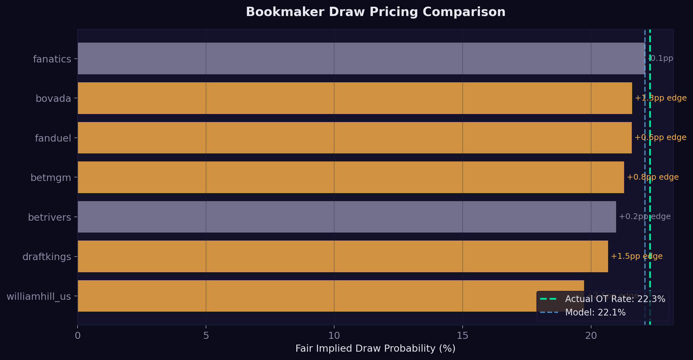

*Figure 6 shows each bookmaker's average fair draw implied probability as a horizontal bar. The green dashed line marks the long-run actual draw rate (22.3%), the blue line marks the model. Every book to the left of the green line is underpricing draws. The gap between each bar and reality is the structural edge, ranging from 2.5pp at William Hill down to essentially zero at Fanatics.*

### The Edge Calculation

For every game, every night, across every bookmaker, the edge calculation is simple:

**Draw Edge = Model P(Draw) − Market Fair P(Draw)**

If the model says a game has a 23.5% chance of going to overtime and the devigged market says 21.0%, that's a +2.5 percentage point edge.

The model finds positive draw edge on 100% of game-bookmaker combinations in the backtest (after the burn-in period). The average edge is 1.8pp. On the best books (William Hill), the average edge is 2.5pp. On the tightest books (BetRivers), it's still 0.9pp.

This isn't cherry-picking. This is a systematic, structural mispricing that exists across every game because the market fundamentally underprices draws.

---

## 5. The Conservation Law in Practice

### Why the Profit Line Fluctuates

My model bets draws. It has a genuine long-run edge of about 1.8pp per bet. But in any given month, the actual draw rate can be well above or well below the long-run average. When the actual draw rate temporarily drops to 19.7% (like February 2025), draw bets lose more than expected. When it spikes to 29.3% (like November 2025), draw bets outperform significantly.

The draw rate varies month to month because of real structural factors: schedule density, goalie workloads, standings compression, and the parity dynamics discussed in Part 2. Meanwhile, the market prices draws at an essentially constant number. That gap between a moving reality and static pricing is the source of both the edge and the variance.

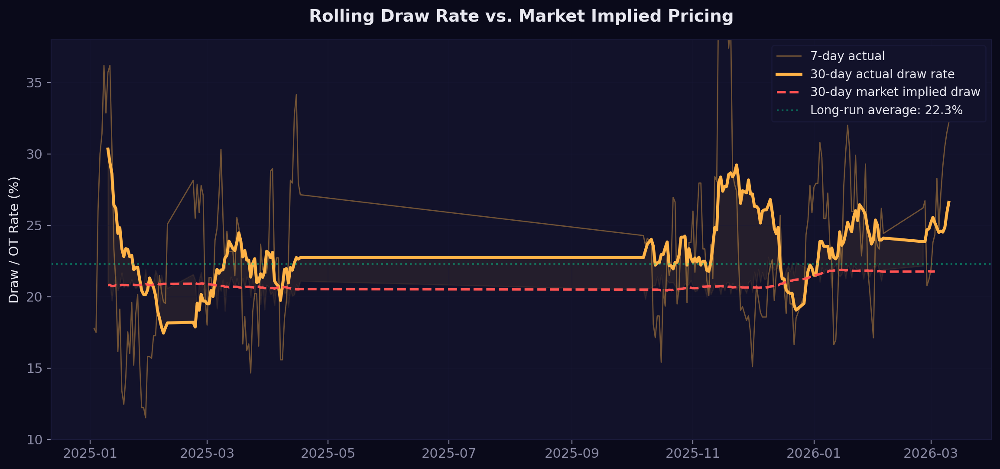

*Figure 7 shows the 30-day rolling actual draw rate (amber) against the 30-day rolling market implied draw rate (red dashed). The actual rate swings from below 15% to above 30%. The market implied rate barely moves, stuck in a narrow 20-21% band. The gap between these two lines is the mispricing.*

### The Conservation Law and Drawdown Protection

The probability conservation constraint has a direct practical application: it provides a natural hedge.

As shown in the monthly data, when draws decrease, the probability mass flows primarily to home wins (r = -0.75 across 40 months). This means that during stretches where draw bets are underperforming, home regulation wins are simultaneously running above their expected rate. A model that prices all three outcomes can exploit this by betting both sides of the conservation equation.

The model bets draws when the draw edge exceeds 2.5%. It also bets home regulation wins when the home edge falls between 2.5% and 5%. Both bets can fire on the same game because they target different outcomes. The purpose of the home side is not to double the action. It is to reduce drawdowns.

A draw-only strategy captures the long-run edge but takes the full variance of the draw rate. When draws go cold for a month, the equity curve drops with nothing to offset it. Adding the home side provides a partial cushion during those stretches, because the same conservation law that reduces draw frequency simultaneously inflates home win frequency.

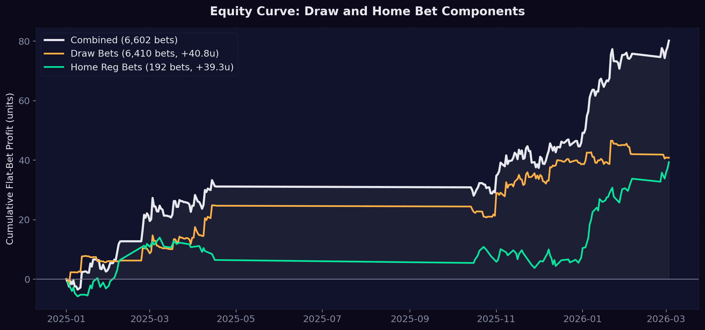

*Figure 8 splits the equity curve into its two components. The amber line shows cumulative profit from draw bets across 1,593 games. The green line shows cumulative profit from home regulation bets (192 games where home edge was 2.5-5%, producing +39.3 units at 20.5% ROI). The white line is the combined portfolio. The two streams are partially complementary: when draws go cold and the amber line dips, the green line often holds steady or climbs. The combined curve is smoother than either alone, because both streams derive from the same conservation constraint.*

### Why the Mispricing Persists

You might ask: if the market is mispricing draws, why doesn't it correct? Why doesn't someone with deep pockets arb this away?

Four reasons:

**First, nobody is thinking about the game this way.** The 3-way regulation market is a derivative of the standard moneyline. Most bettors, including sharp ones, think in terms of "who wins the game," not "does this game end in regulation." The draw is not an outcome that anyone models carefully because it requires a fundamentally different framework: Poisson goal-scoring, tie inflation calibration, 3-way probability decomposition. The edge is not hidden behind complexity. It is hidden behind a framing that almost no one uses. The mispricing persists not because sophisticated actors have analyzed it and passed, but because they have not analyzed it at all.

**Second, recreational behavior is structural.** People will always prefer betting on teams to win rather than betting on draws. This isn't a bug in the market that can be fixed. It's a feature of how humans interact with sports betting. As long as fans want to pick winners, draw pricing will be inefficient.

**Third, deep psychological biases keep bettors away from draws.** Multiple layers of behavioral research explain why the draw outcome is structurally neglected:

*Action bias.* Bar-Eli et al. (2007, *Journal of Economic Psychology*) demonstrated that people have a deep preference for action over inaction, even when inaction is optimal. Betting on a team to win feels like taking action, making a decision, picking a side. Betting on a draw feels like betting on nothing happening. The draw registers as a "non-outcome" psychologically, despite paying 3-to-1.

*Entertainment utility.* Stetzka and Winter (2023, *Journal of Economic Surveys*) found that 56% of sports bettors cite entertainment as their primary motivation. A draw bet offers almost zero entertainment value. You're rooting for a close, low-event game where neither team pulls ahead. There is no team to root for, no dramatic finish to anticipate. Recreational bettors avoid it, and recreational money is what moves these lines.

*Sentiment and team loyalty.* Paul and Weinbach (2012, *Journal of Economics and Finance*) showed that NHL bettors strongly prefer betting on favorites and home teams. Forrest and Simmons (2008, *Applied Economics*) documented similar sentiment-driven betting in soccer. Bettors don't evaluate draws on their merits. They evaluate teams. The draw isn't a team. There is no team loyalty driving action toward the draw.

*The reverse favorite-longshot bias.* The classic favorite-longshot bias says bettors overvalue longshots. But Woodland and Woodland (2001, 2011, *Southern Economic Journal*) found the opposite in NHL markets: a *reverse* FLB where longshot outcomes are actually underbet. The draw at +329 odds is a longshot that receives less action than its probability warrants, not more. This is the opposite of what simple FLB theory would predict, and it means the draw is neglected from both directions: bettors avoid it psychologically AND underbet it relative to its true probability.

**Fourth, the NHL 3-way market is deeply illiquid.**

To understand how illiquid, you need to see where hockey sits in the sports betting ecosystem. According to the Nevada Gaming Control Board's annual data, hockey generated $25.8 million in operator revenue in 2024. Football generated $138.8 million. Basketball $152.5 million. Baseball $71.9 million. Hockey represents roughly 5% of total sports betting handle in the largest regulated market in the United States.

That 5% is the TOTAL hockey handle: moneylines, puck lines, totals, props, futures, everything. The 3-way regulation market is a *derivative* of the primary moneyline. It's a niche within a niche. If hockey is 5% of total handle, the 3-way market is maybe 0.5% of total handle. Maybe less.

Why does this matter? Because **liquidity is the mechanism by which markets self-correct.** In financial markets, when a mispricing exists, arbitrageurs pile in, their capital moves the price, and the inefficiency disappears. This process requires volume, enough capital flowing through the market to push prices toward fair value.

In the English Premier League, where the 3-way market IS the primary betting market, a single match on Betfair's exchange can see £5-12 million matched on match odds alone. Sharp syndicates, market makers, and algorithmic traders all participate. The draw line gets just as much scrutiny as the home and away lines. The result: European soccer 1X2 markets are among the most efficient in all of sports betting. The draw mispricing there is minimal.

Now contrast that with the NHL 3-way market. There are no major exchanges offering it. The volume comes almost entirely from recreational bettors at traditional sportsbooks, the same recreational bettors who overwhelmingly bet on teams, not draws. There's no mechanism for sharp money to correct the draw pricing because there's barely any draw action to correct.

Research on sports betting market efficiency consistently finds that derivative and secondary markets with less volume see prices that remain inefficient longer. Line movement happens more slowly. Mispricings persist for longer windows. The FCS/small-college effect in football, where less-liquid lines start wider and take days to tighten, is the same phenomenon at a smaller scale.

The NHL 3-way market isn't just inefficient because bookmakers are using stale data. It's inefficient because there isn't enough capital flowing through it to force efficiency. The market structure protects the mispricing.

---

## 6. Staking

### How the Model Sizes Bets

The staking logic is simple and edge-proportional. There are no momentum signals, no wave-timing adjustments, no acceleration triggers. The model bets when the edge is large enough and sizes proportionally to the edge.

**Draw bets** fire when the model's draw edge exceeds 2.5% against a given bookmaker. The stake is proportional to the edge size: edge multiplied by 25, capped at 1.5 units. A 3% edge produces a 0.75-unit bet. A 6% edge hits the 1.5-unit cap.

**Home regulation bets** fire when the home edge is between 2.5% and 5.0%. The stake is edge multiplied by 20, capped at 1.0 unit. The narrower edge window and lower cap reflect the fact that home edges are smaller and less persistent than draw edges.

Both sides can fire on the same game because they target different outcomes. The draw bet and the home bet on the same game cannot both win, but they can both have positive expected value simultaneously because the market underprices draws and occasionally overprices home wins relative to the model.

The home side exists as a drawdown buffer. Because draw rate and home win rate are inversely correlated (r = -0.75 across 40 months of data), periods where draw bets underperform tend to be periods where home bets outperform. This is not a timing strategy. Both sides bet every qualifying game regardless of recent results. The diversification benefit comes from the conservation constraint itself, not from any attempt to predict which direction probability mass is flowing on a given night.

---

## 7. Results

### Backtest Results: 1,593 Games

I ran a strict walk-forward backtest covering 14 months of NHL action (January 2025 through March 2026). The first three months of the 2024-25 season are excluded because the model's Bayesian priors need time to calibrate, and including the burn-in period would muddy the results. Walk-forward means the model only uses data available at the time of each prediction, with no peeking at future information. Every bet the model identifies is graded against the actual game result.

The backtest evaluates each game's draw edge across 7 bookmakers (6,410 game-book combinations total). In practice, a bettor shops for the best available odds, so the stats below reflect best-book selection, one bet per game at the highest-edge bookmaker.

**Overall Draw Betting Performance (best book per game):**

| Metric | Value |
|--------|-------|
| Games evaluated | 1,593 |
| Win rate | 24.4% |
| Average draw odds | +329 (4.29 decimal) |
| Average best-book edge | 2.6pp |
| Flat-bet profit | **+12.5 units** |
| Edge-weighted ROI | **+8.1%** |

**Performance by Edge Size (best book per game):**

| Edge Bucket | Games | Win Rate | Flat ROI |
|-------------|-------|----------|----------|
| 0-1% | 169 | 17.8% | +0.0% |
| 1-2% | 382 | 26.4% | +0.0% |
| 2-3% | 453 | 25.2% | +0.3% |
| 3-5% | 530 | 24.3% | +1.3% |
| 5%+ | 59 | 25.4% | +7.6% |

The monotonically increasing ROI by edge bucket is strong evidence that the model's edge estimates are real. It's not just noise that happens to be profitable. The model genuinely identifies stronger opportunities.

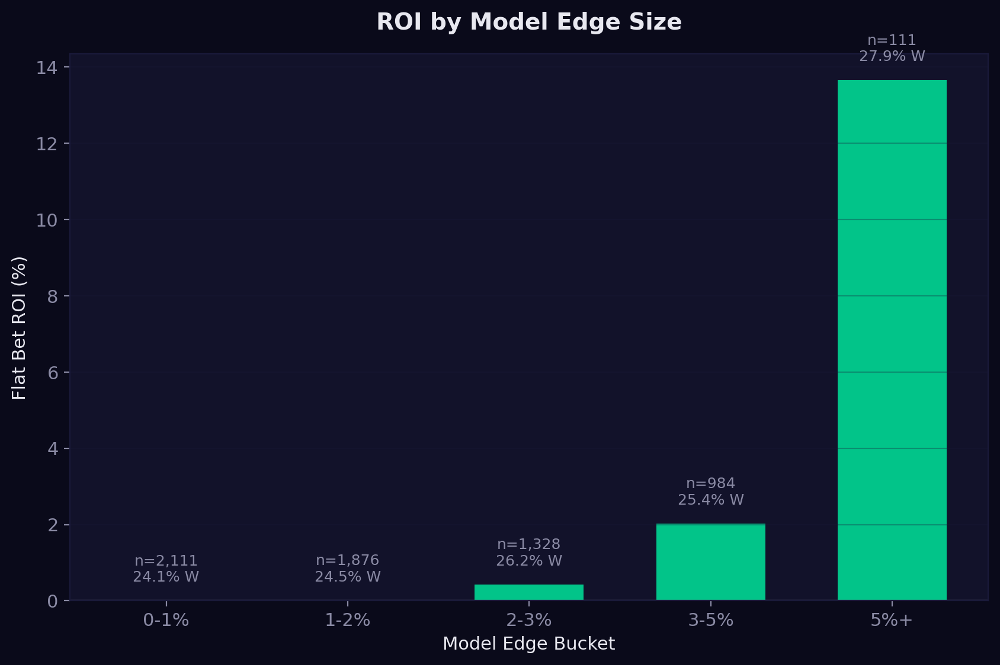

*Figure 10 is the calibration validation chart. Each bar represents a range of model-estimated edge sizes. The key pattern: ROI increases monotonically with edge size. Sub-2% edges are roughly break-even. Above 2%, ROI turns positive. Above 5%, ROI hits +7.6%. If the model were just fitting noise, there'd be no relationship between estimated edge and actual returns. The monotonic trend confirms that the edge estimates are well-calibrated.*

### The Seasonal Shift: Real-Time Adaptation

The shift between seasons provides strong out-of-sample evidence:

**2024-25 season (Jan-Apr):** After the model's calibration period, the actual draw rate was 21.8%, close to the market's pricing. Draw edge was slim. But the model identified that probability mass was concentrated in home regulation wins (46.3% in the second half of the season, even higher than the full-season average). For a model that sees the entire 3-way distribution, this wasn't a wasted period. It was a regime where the home side offered the better edge.

**2025-26 season:** The distribution completely flipped. The actual draw rate surged to 25.8%. The market barely adjusted (moving draw pricing from 20.7% to 21.3%). Draw bets became consistently profitable. Home edge shrank as home win probability mass drained away. The model adapted its tie inflation from 1.30x to 1.40x in weeks. The market moved 0.6pp. Reality moved 4pp.

A probability-redistribution-aware model doesn't bet one outcome indefinitely. It identifies where the distribution is currently mispriced and positions accordingly.

### A Note on Sample Composition

An honest assessment of the backtest must acknowledge its composition. The sample spans two seasons: the tail end of 2024-25 (a normal OT environment at 20.7%) and the bulk of 2025-26 (an abnormally high OT environment at 25.8%). The 2025-26 season, driven by the league parity discussed above, has produced one of the highest sustained overtime rates in recent NHL history. Because the model profits primarily from the gap between the actual draw rate and the market's draw pricing, and because that gap was far wider in 2025-26 than in 2024-25, the backtest results are disproportionately driven by one unusually favorable season.

This is worth stating plainly. If future seasons revert to a 20-21% OT rate and the market's pricing stays in the same range, the draw edge narrows considerably. The model would still identify positive edge (the market priced draws at 20.9% even when reality was 20.7%, so the structural underpricing exists in normal environments too), but the magnitude would be smaller and the profit rate lower.

The model's Bayesian design is built for exactly this uncertainty. It does not assume the current regime will persist. If the 2026-27 season opens with a lower OT rate, the tie inflation parameter will drift back down, edge estimates will shrink, and the staking system will naturally reduce exposure. The model tracks the regime rather than betting on a single season's distribution being permanent.

The stronger claim is not that the 2025-26 edge will repeat at the same magnitude every year. It is that the market's structural inability to reprice draws quickly, combined with the probability conservation constraint, will produce exploitable gaps whenever the OT rate deviates meaningfully from the long-run average, in either direction. The 2025-26 parity-driven surge is one such deviation. There will be others, and the model is designed to detect and adapt to them regardless of direction.

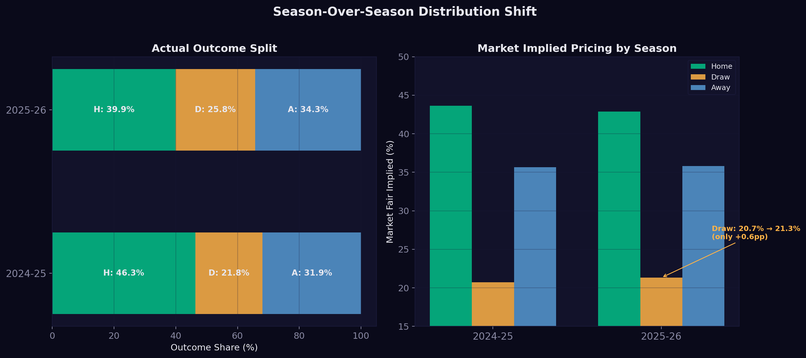

*Figure 11 shows the regime change side by side. The left panel stacks the actual outcome distribution for each season. You can see the draw slice grow and the home slice shrink between 2024-25 and 2025-26. The right panel shows the market's fair pricing for each season. The draw bars barely change. The annotation highlights the disconnect: the market moved draw pricing by only 0.7pp against a 5.2pp actual shift.*

### Bookmaker-Level Results

Not all books are equal. After power devigging:

| Bookmaker | Avg Fair Draw % | Avg Model Edge |
|-----------|----------------|---------------|
| William Hill | 19.7% | +2.5pp |
| DraftKings | 20.7% | +2.0pp |
| FanDuel | 21.6% | +1.6pp |
| Bovada | 21.6% | +1.5pp |
| BetMGM | 21.3% | +1.3pp |
| Fanatics | 22.1% | +1.0pp |
| BetRivers | 21.0% | +0.9pp |

William Hill underprices draws the most aggressively, creating a 2.5pp average edge. Even the tightest books (Fanatics, BetRivers) still show roughly 1pp of edge. Shopping across books matters. The same game can offer a +2.5pp edge at one book and +0.9pp at another.

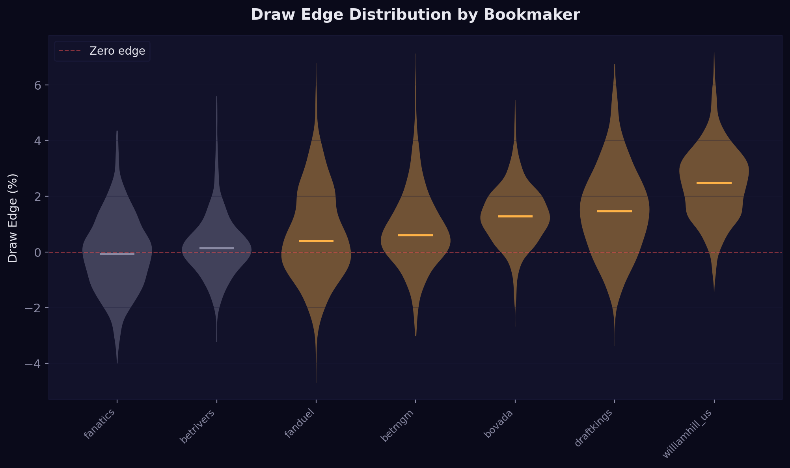

*Figure 12 uses violin plots to show the full distribution of draw edge at each bookmaker. The width of each violin represents how often that edge size occurs. Books on the left have wider distributions skewed positive (consistent large edge). Books on the right have narrower distributions centered closer to zero (smaller but still positive edge). The key takeaway: book selection matters. The same matchup can offer +3pp edge at William Hill and +0.5pp at BetRivers.*

---

## 8. Discussion

### The Conservation Law Framework

The core insight of this paper is not about prediction accuracy. It is about the conservation constraint.

In a 3-way market, **probability mass is conserved.** Like energy in physics, it cannot be created or destroyed, only transferred between states. When the OT rate rises from 20.7% to 25.8%, those 5.1 percentage points did not appear from nowhere. Across 40 months of data, the correlation between monthly draw rate and home win rate is r = -0.75, meaning probability mass flows primarily between these two outcomes. Away wins are largely unaffected.

This conservation law has three practical consequences:

**First, it explains why the mispricing is structural.** The market needs to price three interconnected quantities. It gets two of them roughly right (home and away) but systematically underprices the third (draw). Because the three must sum to 100%, the error on the draw side is mechanically absorbed by the other two.

**Second, it provides a natural hedge.** Because draws and home wins move inversely, a model that bets both sides of the conservation equation reduces drawdowns without sacrificing expected value. The home side is not a separate strategy. It is the same mispricing observed from the opposite direction.

**Third, it identifies where the market's failure comes from.** The market fails on draws specifically because nobody actively trades them. In a 2-way market, neglecting one side is impossible because it immediately misprices the other. In a 3-way market, the third outcome can sit neglected for months because the error distributes across two other outcomes that are individually close to correct.

### Why Most Bettors Miss This

Even sharp bettors with good models are mostly focused on 2-way markets. They bet moneylines and puck lines, where the market is more efficient. The 3-way regulation market is a niche that does not attract enough capital to force efficient pricing, especially on the draw outcome.

The distribution shifts because of real structural factors: league-wide parity, schedule density, goalie workloads, late-season standings compression. When these factors push more games to overtime, probability mass genuinely moves from regulation wins to draws. And the market, treating draw pricing as essentially constant, falls behind.

The market moved its draw pricing by 0.65pp in response to a 5.16pp actual shift. That gap, between how fast reality moves and how slowly the market adjusts, is where the edge lives. And we can see why it persists by looking at the one place where the 3-way market IS efficient: European soccer.

### The European Soccer Proof

In England's Premier League, the 1X2 (3-way) market IS the primary market. It's the default. It's what everyone bets. A single match on Betfair's exchange can see £5-12 million matched on match odds alone. Sharp syndicates, market makers, and algorithmic traders all participate. The draw gets just as much scrutiny as the home and away lines.

The result? The draw mispricing in European soccer is minimal. Academic research by Vlastakis, Dotsis, and Markellos (2009) found that while bookmakers are "inefficient in terms of predicting draws" even in European soccer, the magnitude is far smaller than what we see in NHL. When massive liquidity flows through a 3-way market, it approaches efficiency, not perfect, but close.

Now look at the NHL. Hockey generates roughly 5% of total US sports betting handle. The 3-way regulation market is a *derivative* of the already-small hockey moneyline. There are no major exchanges offering it. The volume comes almost entirely from recreational bettors who overwhelmingly bet on teams, not draws.

This comparison proves the point: **the draw mispricing isn't inherent to the 3-way format. It's a function of liquidity.** When the 3-way market has massive volume (soccer), draw pricing tightens. When it has minimal volume (NHL), draw pricing stays loose. The NHL 3-way market is exactly the type of niche, illiquid market that every piece of sports betting research identifies as most exploitable.

The sum-to-100% constraint is permanent. The bettor preference for picking winners over betting draws is permanent. The niche status of the NHL 3-way market is structural. As long as these features persist, probability redistribution will create exploitable patterns.

### Sustainability of the Edge

The key question for any betting edge is whether it will be arbitraged away. The evidence suggests this one will not: the edge per bet is too small to attract institutional capital, the market is too illiquid for sharp money to correct pricing efficiently, and the behavioral biases that drive recreational bettors away from draws show no sign of changing.

---

## References

- Bar-Eli, M., Azar, O. H., Ritov, I., Keidar-Levin, Y., & Schein, G. (2007). Action bias among elite soccer goalkeepers: The case of penalty kicks. *Journal of Economic Psychology*, 28(5), 606-621.
- Forrest, D., & Simmons, R. (2008). Sentiment and betting on English football. *Applied Economics*, 40(4), 513-519.
- Paul, R. J., & Weinbach, A. P. (2012). Sportsbook behavior in the NHL. *Journal of Economics and Finance*, 36(1), 18-33.
- Stetzka, V., & Winter, S. (2023). Motivations for sports betting: A review and future research agenda. *Journal of Economic Surveys*, 37(4), 1264-1292.
- Vlastakis, N., Dotsis, G., & Markellos, R. N. (2009). How efficient is the European football betting market? Evidence from arbitrage and trading strategies. *Journal of Forecasting*, 28(5), 426-444.
- Woodland, L. M., & Woodland, B. M. (2001). Market efficiency and profitable wagering in the National Hockey League. *Southern Economic Journal*, 67(4), 983-995.
- Woodland, L. M., & Woodland, B. M. (2011). The reverse favourite-longshot bias in the National Hockey League. *Southern Economic Journal*, 78(1), 64-76.

---

*Disclaimer: This paper is for educational and informational purposes only. Sports betting involves risk and past performance does not guarantee future results. Always bet responsibly and within your means. Sports betting may not be legal in your jurisdiction.*

**Whizard Analytics** | whizardanalytics.com
